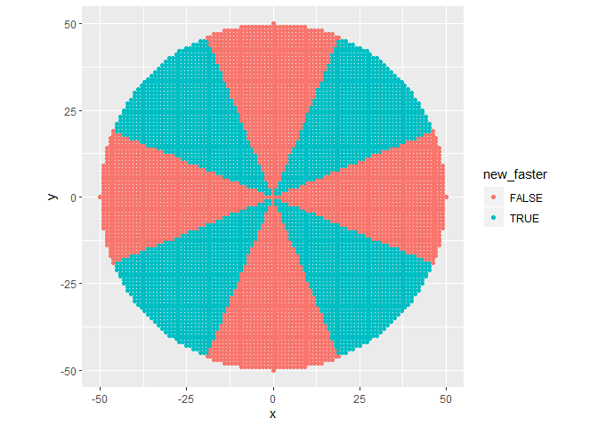

Riddler Solutions
================
Bryan Shalloway
2/21/2020

``` r
library(tidyverse)
```

# Riddler express

*Remove points with euclidian distance from center \> radius:*

``` r
radius <- 50
df_start <- crossing(x = -radius:radius, y = -radius:radius) %>% 
  mutate(dist_center = sqrt(x^2 + y^2)) %>% 
  filter(dist_center <= radius)
```

``` r
devtools::source_gist("https://gist.github.com/brshallo/6a125f9c96dac5445cebb97cc62bfc9c")

# animate_matrix_transformation(m = matrix(c(1, -1, 1, 1), nrow = 2))
```

``` r
df_dists <- df_start %>% 
  mutate(man_units = abs(x) + abs(y),
         man_dist = 1 * man_units,
         x_trans = x,
         y_trans = y) %>% 
  # x_trans, y_trans represent the coordinates on the new plane
  transform_df_coords(x_trans, y_trans, m = matrix(c(1, -1, 1, 1), nrow = 2)) %>% 
  mutate(man_units_trans = abs(x_trans) + abs(y_trans),
         man_dist_trans = (sqrt(2) / 2) * man_units_trans)

df_dists %>% 
  summarise(prop_shorter = sum(man_dist_trans < man_dist)/ n())
```

    ## # A tibble: 1 x 1
    ##   prop_shorter
    ##          <dbl>
    ## 1        0.500

``` r
df_dists %>% 
  summarise(avg_dist = mean(man_dist),
            avg_dist_trans = mean(man_dist_trans))
```

    ## # A tibble: 1 x 2
    ##   avg_dist avg_dist_trans
    ##      <dbl>          <dbl>
    ## 1     42.4           42.4

``` r
df_dists %>% 
  mutate(new_faster = man_dist_trans < man_dist) %>% 
  ggplot(aes(x = x, y = y))+
  geom_point(aes( colour = new_faster))+
  coord_fixed()
```

<!-- -->

Riddler express solution –\> is faster for 50% of people

# Riddler classic

Barcelona distance is just a combination of manhattan distance for both
original and transformed. So will need to calculate for both and set a
constant for how big corners are.

``` r
# x represents height of diagonal
x <- 0.25
side_length <- 1 - 2*x
side_length_trans <- sqrt(2)*x

df_dists_b <- df_dists %>% 
  # select(-contains("_dist")) %>% 
  mutate(man_dist_b = man_units * side_length,
         man_dist_trans_b = man_units_trans * side_length_trans,
         man_dist_all_b = man_dist_b + man_dist_trans_b) %>% 
  select(x, y, contains("dist"), -dist_center)
```

``` r
df_dists_b %>% 
  mutate(new_faster = man_dist_all_b < man_dist) %>% 
  ggplot(aes(x = x, y = y))+
  geom_point(aes( colour = new_faster))+
  coord_fixed()
```

<!-- -->

``` r
df_dists_b %>% 
  summarise(prop_shorter = sum(man_dist_all_b < man_dist)/ n())
```

    ## # A tibble: 1 x 1
    ##   prop_shorter
    ##          <dbl>
    ## 1        0.500

``` r
df_dists_b %>% 
  summarise(avg_dist = mean(man_dist),
            avg_dist_trans = mean(man_dist_trans),
            avg_dist_b = mean(man_dist_all_b))
```

    ## # A tibble: 1 x 3
    ##   avg_dist avg_dist_trans avg_dist_b
    ##      <dbl>          <dbl>      <dbl>
    ## 1     42.4           42.4       42.4

  - In the case when x = 0.25, is equal

*Check across cases:*

``` r
summarise_closer <- function(x, df_start = df_dists){

side_length <- 1 - 2*x
side_length_trans <- sqrt(2)*x

df_dists_b <- df_start %>% 
  # select(-contains("_dist")) %>% 
  mutate(man_dist_b = man_units * side_length,
         man_dist_trans_b = man_units_trans * side_length_trans,
         man_dist_all_b = man_dist_b + man_dist_trans_b) %>% 
  select(x, y, contains("dist"), -dist_center)

df_dists_b %>% 
  summarise(prop_shorter = sum(man_dist_all_b < man_dist)/ n()) %>% 
  pluck("prop_shorter")
}
```

Check varying the height of the diagonal

``` r
x_vec <- seq(from = 0.01, to = 0.49, by = 0.03)

df_summary <- tibble(x_len = x_vec) %>% 
  mutate(prop_shorter = map_dbl(x_vec, summarise_closer))

df_summary
```

    ## # A tibble: 17 x 2
    ##     x_len prop_shorter
    ##     <dbl>        <dbl>
    ##  1 0.01          0.500
    ##  2 0.04          0.500
    ##  3 0.0700        0.500
    ##  4 0.10          0.500
    ##  5 0.13          0.500
    ##  6 0.16          0.500
    ##  7 0.19          0.500
    ##  8 0.22          0.500
    ##  9 0.25          0.500
    ## 10 0.28          0.500
    ## 11 0.31          0.500
    ## 12 0.34          0.500
    ## 13 0.37          0.500
    ## 14 0.4           0.500
    ## 15 0.43          0.500
    ## 16 0.46          0.500
    ## 17 0.49          0.500

  - Across all lengths of sides still is faster for 50% of people
